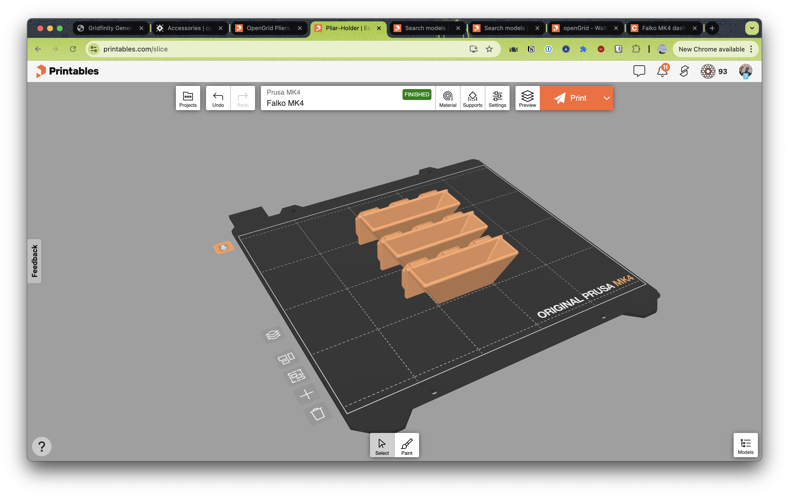
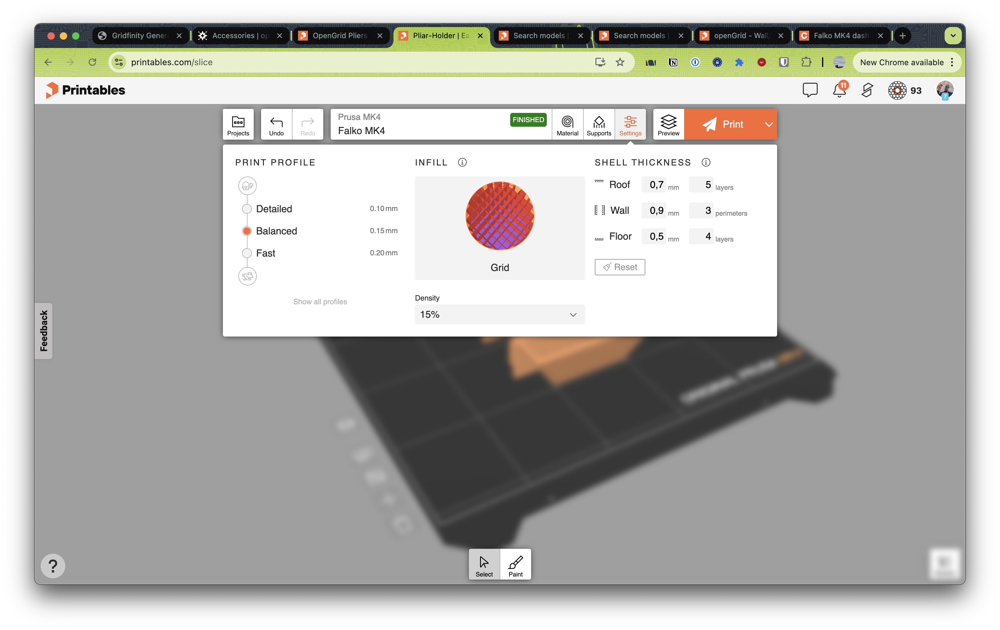
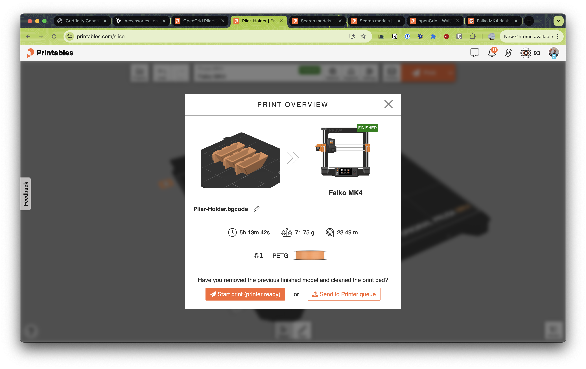
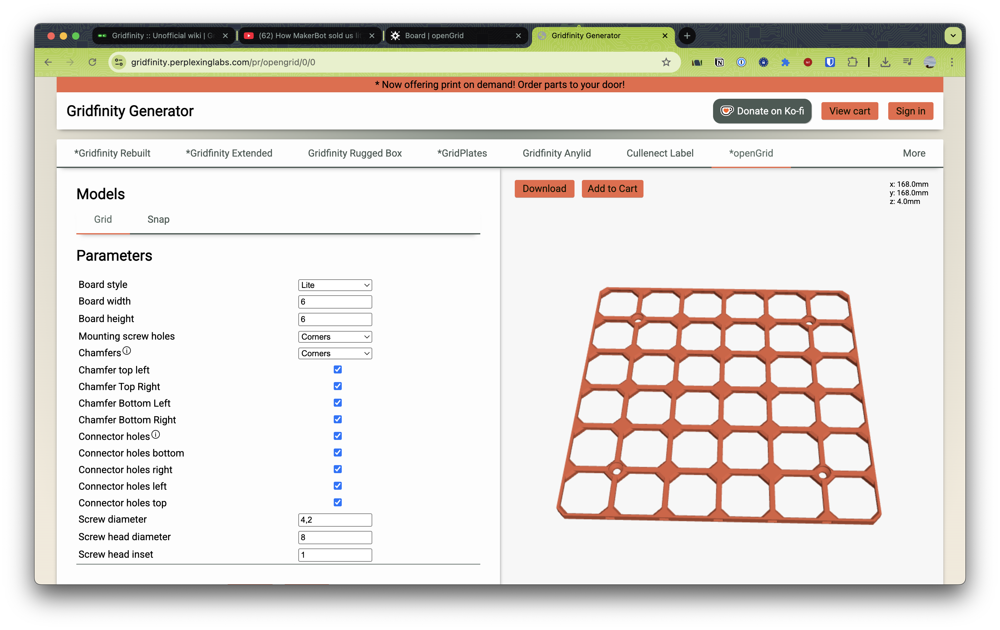

Gridfinity Grids. Wenn du willst, kann ich mal ein gutes Beispiel raussuchen. Genrel wäre das hier ein guter Sart: 

* https://gridfinity.perplexinglabs.com/pr/gridplates/0/0
* mit Magneten: https://makerworld.com/en/models/781960-gridfinity-magnet-base-all-sizes#profileId-719178, 
* Ultra-Leicht: https://www.printables.com/model/1233707-ultralight-gridfinity-bases
* schön für auf dem Tisch: https://www.printables.com/model/1123454-gridfinity-desktop-baseplates

* Carousel https://www.printables.com/model/897707-gridfinity-carousel-motorized

opengrid ist kleiner
* opengrid kann angeschraubt werden
* opengrid kann über Kopf geschraubt werden
* Falko hat unter https://www.printables.com/@falkorichter_1026034/collections/2793569 eine collection gestartet

Screenshots

